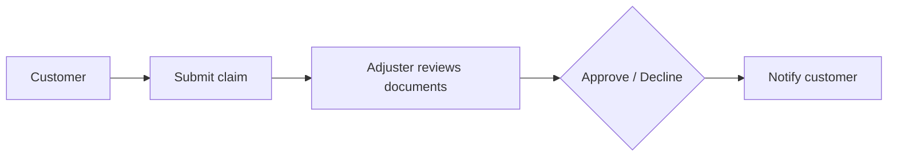
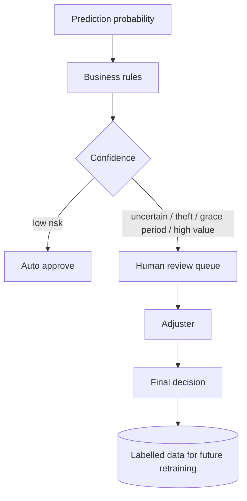

# DESIGN — GenAI-Powered Insurance Claim Approval Agent

**Version** 1.0 · **Phase** 0 (Business Understanding & Design)

A senior engineer does not start by choosing libraries. The order is: understand the business
problem, derive the requirements, take the design decisions, shape the architecture, and only
then select technology. This document follows that order, and every technology choice below
points back to the requirement that forced it.

---

## 1. Business problem

A device-insurance operation handles claims — accidental damage, liquid damage, theft — for
smartphones, tablets, laptops, and wearables across the Netherlands, Sweden, and Finland.
The current process is:



Five problems follow from it.

### 1.1 Slow processing

Every claim is reviewed manually. A single review takes minutes to hours, and roughly 84% of
claims are approved — most of them routine. Human attention is spent uniformly on a caseload
that is anything but uniform. As volume grows, waiting time grows with it, customer
satisfaction falls, and operating cost rises.

### 1.2 Inconsistent decisions

Two adjusters can review comparable claims and reach opposite conclusions. The decision
depends on individual experience rather than a shared standard, and nothing in the current
process surfaces the divergence. The data shows patterns — Grace Period policies decline at
28.6% against 15.6% for active ones — that clearly live in individual heads rather than in a
stated rule.

### 1.3 No explanation

A declined customer receives *"your claim has been declined."* No reason, no factors, no
recourse they can act on. The consequences are predictable: complaints rise, trust falls, and
the contact centre absorbs calls that exist only because the first message said nothing.

Internally the situation is no better — the reasoning behind a past decision is not
reconstructable. Under GDPR Article 22 and the EU AI Act's transparency provisions, an
automated or automation-assisted decision affecting a person requires a meaningful
explanation. *"The system declined it"* does not qualify.

### 1.4 Different stakeholders need different information

Not every user needs the same depth.

- **Customer** — a simple, understandable explanation. A probability tells them nothing and
  invites an argument about the number.
- **Adjuster** — a technical explanation with the evidence that supports the recommendation.
- **Auditor** — model version, prompt version, SHAP values, timestamps, data lineage. Full
  traceability.

The same decision must be presented three ways. This is not a cosmetic requirement: an
adjuster denied the SHAP values cannot do their job, and a customer shown them learns nothing.

### 1.5 Human review is mandatory

AI must not decide alone. Borderline cases, suspected fraud, and high-value claims carry
financial and legal consequences that justify a human. The system must route, not rule.

## 2. Objectives

| # | Objective |
| --- | --- |
| O1 | Predict claim outcome (Approved / Declined) from structured historical data |
| O2 | Explain each decision through an LLM, adapted per persona — customer, adjuster, auditor |
| O3 | Expose the capability as a REST API consumable by any external system |
| O4 | Apply MLOps: track experiments, models, metrics, versions |
| O5 | Apply LLMOps: track prompts, tokens, latency, cost, output quality |
| O6 | Guarantee that every decision is explainable and auditable |

**Non-objective:** replacing the adjuster. The system assists.

## 3. Why this architecture

Analysis of the problem shows it is not one problem but two.

**Problem A — prediction.** *Will this claim be approved or declined?* A classification
problem. Solved by machine learning.

**Problem B — explanation.** *How do we express why?* Not a machine-learning problem at all —
a natural-language generation problem. Solved by an LLM.

Conflating them is the common failure mode: asking an LLM to *decide* produces a system that
is unauditable, non-reproducible, and prone to hallucinating its way to an outcome. So the
system splits in two:

```
Prediction Engine   +   Explanation Engine
```

The ML model decides. The LLM explains. Because the LLM only ever receives facts already
computed — the score, the SHAP attributions, the claim fields — it has nothing to invent a
decision *from*. This structurally reduces hallucination rather than merely discouraging it.

### Design principles

- **Separation of concerns** — ML predicts, LLM explains, API serves, monitoring observes.
  Each component has exactly one responsibility.
- **Modularity** — any component can be replaced without touching the others.
- **Explainability by design** — no decision is ever returned without a SHAP-backed
  explanation. This is a structural property, not a feature that can be switched off.
- **Human-centred AI** — the final decision remains reviewable by a human.
- **Provider agnostic** — the LiteLLM layer means changing LLM vendor is a config change.
- **Observability first** — MLflow and Langfuse are wired in from the start, not retrofitted.
- **Production-oriented** — the system runs locally, but the architecture ports to AWS with
  minimal change.

## 4. Success criteria

### 4.1 Machine learning

| Metric | Target | Rationale |
| --- | --- | --- |
| F1 (Declined) | > 0.45, honestly reported | The minority class carries the business consequence, and it is the only metric that can actually move at 5.36:1 |
| Recall (Declined) | > 0.55 at the operating threshold | A missed decline is money paid that should not have been |
| ROC-AUC | > 0.70 | Threshold-free ranking quality — supports triage even where point classification is weak |
| PR-AUC | Reported alongside | Under imbalance, PR-AUC is the more honest summary; ROC-AUC flatters minority problems |
| CV stability | std(F1-Declined) < 0.08 over 5 stratified folds | High fold variance on 453 positives means fitted to noise, not learned |

**Accuracy is explicitly excluded.** Predicting "Completed" for everything scores 84.3%. Any
metric a constant classifier can win is not measuring the problem.

These are thresholds for honest reporting, not numbers to be reached by tuning against the
test set. If the data does not support them, Phase 1 reports the real figures and diagnoses
why.

### 4.2 GenAI

| Metric | Target | Measured by |
| --- | --- | --- |
| Schema compliance | > 98% | `OutputValidator` parse rate |
| Faithfulness | > 0.80 | DeepEval, in CI |
| Hallucination | < 0.20 | DeepEval, in CI |
| Answer relevancy | > 0.75 | DeepEval, in CI |
| Numeric grounding | 100% | Every number in an explanation must appear in the input or the SHAP output — checked programmatically |
| Persona adherence | 100% on hard constraints | No score, SHAP, or model terminology ever reaches a customer |
| Sentiment consistency | 100% | A declined claim never produces approval language |
| Provider equivalence | Fallback within tolerance of primary | Promptfoo |
| Prompt-injection resistance | 0 successful | Adversarial `issueDesc` payloads |

### 4.3 System

| Metric | Target |
| --- | --- |
| `POST /predict` p95 | < 200 ms |
| `POST /explain` p95 | < 5 s |
| Graceful LLM degradation | Prediction always returned, even when both providers fail |
| Reproducibility | Model version + prompt version + data hash pinned per prediction |

## 5. Assumptions

1. **Historical labels are ground truth.** `status` records what an adjuster decided. Any bias
   in past human decisions is learned by the model — which is why Phase 4 measures
   decline-rate disparity by country, channel, and device type rather than assuming fairness.
2. **The training distribution resembles production.** Drift monitoring exists because this
   assumption expires.
3. **`Completed` means approved and paid**, with no intermediate state hidden in the label.
4. **Diagnostic fields are missing not-at-random.** Absence reflects the intake channel — a
   phone claim skips the checklist — not the device's condition. Treated as signal, not noise.
5. **`issueDesc` is untrusted input.** Customer-authored free text, handled as a
   prompt-injection vector throughout.
6. **`issueDesc` is excluded from ML features.** Multilingual free text over 2,880 rows would
   need embeddings whose dimensionality dwarfs the sample. It goes to the LLM instead, where
   it adds value without adding variance.
7. **`oldBalanceRRP` carries no independent information** — bit-identical to `balanceRRP`
   across all 2,880 rows.
8. **Constant columns are export artefacts, not features.** `make`='WUAWEI' reflects a
   single-manufacturer extract. If a second brand appears, this assumption must be revisited.
9. **Mixed date formats are an export artefact**; `dayfirst=True` is correct for all three
   locales.
10. **SEK/EUR conversion at 10.3** is a modelling simplification: one static rate applied to
    a dataset spanning multiple months, where the true rate moved. Ratios were added
    specifically so the model does not depend on the rate being exact (§7.1).
11. **The LLM explains and never decides.** No code path allows LLM output to alter a score,
    a threshold, or an outcome.
12. **A human reviews every decline.** The system recommends; it does not issue adverse
    decisions unsupervised.
13. **EU data protection applies.** NL, SE, FI are all EU; GDPR governs processing, logging,
    and transfer to any LLM provider (DPA required).
14. **2,880 rows is the ceiling.** No further historical data is obtainable in the project
    window. This bounds model complexity and is the principal reason a neural network is
    rejected (§8.1).

## 6. What the data actually supports

Verified directly from the source file before any modelling:

| Fact | Value |
| --- | --- |
| Shape | 2,880 × 35 |
| Class balance | 2,427 Completed / 453 Declined — **5.36 : 1** |
| Decline rate by claim type | Theft 20.4% (n=98) · Liquid Damage 19.4% (n=67) · Accidental 15.5% (n=2,715) |
| Decline rate by country | NL 17.4% · FI 16.2% · SE 13.5% |
| Decline rate by policy status | Grace Period 28.6% (n=28) · Active 15.6% · InActive 0% (n=3) |
| Median `rrp` | SE 14,990 (SEK) · NL and FI 1,449 (EUR) |
| `issueDesc` | 0% null, median 205 characters, four languages |

Two observations shape everything downstream.

**The strongest categorical signals sit on the smallest samples.** Grace Period declines at
nearly double the base rate — on 28 claims. Liquid Damage has 13 declined examples in total.
A model will find these patterns; none can validate them at that sample size. This is the
empirical justification for Human-in-the-Loop, not a hedge.

**The tabular features describe the policy and the device, not the circumstances of the
loss** — and the circumstances are what drive a decline. That information does exist in the
dataset, but it lives in `issueDesc`, as prose, in four languages.

Neither is a defect to be tuned away. Together they set the honest framing: **the model
provides triage; the explanation layer provides the value.** Confident approvals route
through; everything else reaches a human with the evidence already assembled and rendered.

## 7. Key data decisions

### 7.1 Currency normalisation — the highest-impact decision

The dataset mixes currencies. SE amounts are SEK; NL and FI are EUR.

| Column | SE median | NL/FI median | Implied rate |
| --- | --- | --- | --- |
| `rrp` | 14,990 | 1,449 | 10.35 |
| `excessFee` | 619 | 59 | 10.49 |
| `balanceRRP` | 14,490 | 1,399 | 10.36 |

Left uncorrected, the model learns that a large amount means *Sweden* rather than learning
the real relationship between a device's financial value and the approval decision. This is
**country leakage** (more precisely, currency leakage). Its damage is not limited to accuracy:
because `country` is already an explicit feature, the raw amounts become a second, implicit
encoding of the same variable, and SHAP splits country's true contribution across four
features. Attribution becomes meaningless — and the entire project is built on SHAP feeding
the LLM. Corrupting attribution corrupts the explanations, which are the deliverable.

**Decision — normalise, and keep ratios.**

1. Convert `rrp`, `balanceRRP`, and `excessFee` to EUR. The rate lives in
   `configs/training.yaml` so it is changeable without touching code:

   ```yaml
   currency:
     base_currency: EUR
     sek_to_eur_rate: 10.3
   ```

   The rate is **derived from the data**, cross-validated across three independent columns
   (10.35 / 10.49 / 10.36) — measured, not assumed.

2. Add currency-invariant ratios: `fee_to_rrp_ratio`, `balance_ratio`,
   `remaining_balance_ratio`. These are immune to the conversion by construction —
   500/1,000 and 5,000/10,000 both give 0.5 — so the model does not depend on the rate
   being exact.

3. **Do not delete the absolute amounts yet.** They stay through training; their SHAP
   importance is then measured. If they still carry information beyond the ratios, they are
   kept; if the ratios suffice, they are dropped to simplify the model. The final feature set
   is therefore an empirical result, not an assumption.

**Why not drop the absolutes immediately?** It discards real information. A €199 excess on a
€400 device and a €199 excess on a €3,199 device do not share the same economics, and the
ratio is not the only thing separating them — absolute exposure matters at different price
tiers. Deleting the amounts before seeing evidence is a decision taken ahead of measurement,
which is the same error as leaving the leakage in: both substitute assumption for data.

**Why not leave it and document the risk?** Documenting a known defect does not neutralise
it. The model would still learn the country proxy, and SHAP would still misattribute. Since
the explanations are the product, this is not a cost that can be absorbed.

### 7.2 Missing diagnostics as signal

Nine diagnostic fields (`turnOnOff` … `charging`) are 7–24% missing, and the missingness is
structural: a phone-channel claim never fills the checklist.

Imputing `0` would assert *"component tested, found broken"* — factually false, and it would
inject the intake channel into the damage signal. The sentinel `-1` keeps *"never assessed"*
as its own state, and `diag_completeness` turns the missingness pattern itself into a
feature. Data completeness is predictive here; erasing it would throw away information.

### 7.3 Free text held out of the model

`issueDesc` is 0% null, four languages, median 205 characters — genuinely the richest field
in the dataset. It is nonetheless excluded from the feature matrix: any embedding would
produce hundreds of dimensions over 2,880 rows and 453 positives, which is a recipe for
memorisation, not learning.

Instead it is routed to the LLM as narrative context for the adjuster and auditor personas,
where it improves the explanation without destabilising the model. This is the separation of
concerns paying for itself: the text is used where it helps and excluded where it hurts.

### 7.4 Other data-quality findings

| Finding | Handling |
| --- | --- |
| 1 negative `balanceRRP` (SE) | Clipped to 0, flagged in the data-validation report |
| 3 rows with `rrp = 0` | Ratio features guarded against division by zero |
| 1 row with `excessFee = 0` | Retained — a zero excess is plausible |
| `make` null in 3 rows | Column dropped regardless (constant) |
| `balanceRRP > rrp` | Never occurs — consistency check passes |

## 8. Technology choices

### 8.1 Machine learning model — XGBoost

Six model families are trained on identical folds with identical preprocessing, so the
rejections rest on measurement rather than opinion.

**Logistic Regression** — simple, fast, interpretable. But it assumes linear relationships,
and insurance data is not linear. Used as a baseline reference only.

**Random Forest** — strong, needs no scaling, well suited to tabular data. Genuinely
competitive on this problem. Ranked below XGBoost because it lacks native missing-value
handling (significant when `deviceType` is 48% absent and the missingness is itself
informative), and because TreeSHAP is less optimised for it.

**CatBoost and LightGBM** — benchmarked as gradient-boosting alternatives. Both are credible;
selection is reported from the results table.

**Neural network (MLP)** — rejected, and rejected on principle as well as by measurement:

- The dataset is ~2,880 rows. Below this regime networks do not beat gradient boosting on
  tabular data.
- Requires scaling, architecture search, and regularisation — complexity with no expected
  return.
- Requires synthetic oversampling to handle the imbalance.
- Its only SHAP option is KernelExplainer: approximate and orders of magnitude slower than
  TreeSHAP.

That last point is decisive. The project's central asset is exact, fast attribution. An MLP
trades it away for no expected accuracy gain. It is still benchmarked so the rejection carries
a number, not just an argument.

**XGBoost** — the expected production model:

- Excellent on tabular data.
- Handles missing values natively.
- Fast.
- Well-behaved under class imbalance (`scale_pos_weight`).
- Exact, fast TreeSHAP integration.
- Widely deployed in finance and insurance, with a mature ecosystem (MLflow, ONNX, cloud).

Also rejected without benchmarking: a rules engine. It cannot weigh interacting evidence, and
encoding the observed patterns as rules would hard-code decisions taken on 28-row samples.

### 8.2 Explainability — SHAP

The model returns *Approved* or *Declined*. It does not answer *why*. SHAP computes each
feature's contribution to each individual prediction:

```
excessFee (EUR)       +0.42
policy_duration_days  +0.31
diag_completeness     -0.18
```

These values become the **factual evidence** the LLM receives. The language model never
invents a reason; it converts numbers into sentences.

`TreeExplainer` specifically: exact Shapley values for tree ensembles in polynomial time,
milliseconds per prediction, fast enough to run inside the request path. KernelExplainer is
model-agnostic but approximate and exponentially slower. **LIME is rejected outright** — its
local surrogates are unstable across runs, and an audit trail that changes when re-run is not
an audit trail.

Note that the choice of explainer constrains the choice of model. That constraint is
intentional: in a regulated setting, exact attribution outranks a marginal accuracy gain.

### 8.3 LLM access — LiteLLM

The system must support more than one provider without code changes. Writing a client per
vendor duplicates retry, timeout, and error handling in every one of them.

LiteLLM gives a single interface across providers, plus fallback, retry, and provider
abstraction. Changing vendor becomes a line in `configs/llm.yaml`.

**GPT-4o-mini** is primary: reliable structured-JSON adherence at low cost, which matters more
here than prose quality — the pipeline depends on schema compliance.

**Gemini Flash** is the fallback, chosen as a *different vendor* rather than a different model
from the same one. A shared outage would defeat the purpose of having a fallback at all.

`temperature = 0.1` — near-deterministic. Comparable claims must receive comparable
explanations; creative variation is a defect in this context.

### 8.4 Prompt templates — Jinja2

Prompts do not belong in Python string literals. `prompt = f"..."` makes every wording change
a code change, makes diffs unreadable, and makes prompt versioning impossible in practice.

Separate files per persona — `customer.jinja2`, `adjuster.jinja2`, `auditor.jinja2` — mean a
prompt can be revised without touching application logic, and its history is visible in git
alongside the code that consumes it.

### 8.5 API — FastAPI

Async request handling, Pydantic v2 validation at the boundary (malformed claims rejected
with 422 before reaching the model), automatic OpenAPI documentation, clean Docker
integration. Flask was rejected: no native async, no automatic validation, no generated
schema.

### 8.6 Experiment tracking — MLflow

Every training run must be reproducible. MLflow records the model, parameters, metrics,
feature list, SHAP explainer, and git commit, and provides a registry with stage transitions
(Staging → Production → Archived). Any previous version can be recovered exactly.

Weights & Biases was rejected on SaaS dependency and cost for a prototype whose artefacts are
commercially sensitive.

### 8.7 Tuning — Optuna

Tree-structured Parzen estimation with pruning finds good hyperparameters in ~50 trials where
grid search needs thousands. Pruning matters as much as the search: unpromising trials are
abandoned early, which is the difference between a tractable and an intractable budget.

### 8.8 LLM observability — Langfuse

After deployment the operational questions are: how long did each request take, how many
tokens did it consume, what did it cost, which provider served it, did it error? Langfuse
records prompt, response, model, tokens, cost, latency, and errors per call. This is the
LLMOps monitoring layer.

### 8.9 LLM evaluation — DeepEval, and Promptfoo

Testing the API is not enough. A response can be valid JSON and still be a bad explanation.
**DeepEval** measures faithfulness, answer relevancy, and hallucination, and runs in CI as
pytest tests — so a prompt regression fails the build the same way a code regression does.

**Promptfoo** is included for one specific job: **verifying the fallback provider is
behaviourally equivalent to the primary.** If GPT-4o-mini is unavailable at 03:00 and Gemini
serves customers instead, someone must already have checked that Gemini holds the customer
persona, does not leak SHAP terminology, and handles Swedish and Dutch narratives. An
unvalidated fallback is untested code on the critical path.

This is a deliberately narrow scope. Promptfoo is **not** used here for prompt A/B testing at
scale — that is the use case that would not justify the extra tool for three fixed personas
and one prompt version, and it is why several reference stacks list it as unnecessary. The
dual-provider requirement creates a need that DeepEval does not cover.

### 8.10 Output validation — Pydantic plus a custom validator

Every LLM response is checked before it leaves the service:

- valid JSON (markdown fences stripped)
- required fields present, correct types
- persona constraints respected
- **no technical internals in a customer response** — a blocklist covering SHAP, probability,
  threshold, model, classifier terminology
- **no fabricated numbers** — every figure must trace to the input or the SHAP output
- **sentiment consistent with the decision** — a declined claim must not read as approved

One retry on failure, then a deterministic template fallback. The prediction is returned
regardless.

### 8.11 Human-in-the-Loop

The goal is not to replace the adjuster but to support them.



Forced-review triggers are independent of the score and follow directly from §6: Theft claims
(highest decline rate, n=98), Grace Period policies (28.6% decline on n=28), high financial
exposure, and claims with too few diagnostic checks to act on.

The system **never auto-declines.** High scores are recommendations. This makes it an *AI
Assisted Decision System*, not an *AI Autonomous Decision System* — aligned with insurance
practice and responsible-AI expectations. The adjuster's decision also becomes labelled
training data, closing the feedback loop.

### 8.12 Deployment — Docker locally, AWS by design

The application runs locally in Docker: identical environment across development, CI, and
demo. The AWS production architecture (API Gateway → ALB → ECS Fargate, with S3 for model and
prompt artefacts, RDS for prediction logs and audit trail, CloudWatch for metrics and alarms,
Secrets Manager for keys, ECR for images) is documented as the production target but **not
provisioned** — deliberate scoping, showing the architecture without incurring the
infrastructure.

## 9. Technologies deliberately excluded

| Technology | Why not |
| --- | --- |
| LangChain | No agent orchestration or RAG workflow here. LiteLLM + Jinja2 is simpler and more maintainable |
| DSPy | Automatic prompt optimisation is unnecessary for three fixed personas |
| RAGAS | Built for retrieval-augmented systems; there is no retrieval in this design |
| Redis semantic cache | Claims are near-unique; hit rate would be negligible. Noted as a future option |
| Pandera | Pydantic already validates API input, and the training dataset is static rather than continuously ingested |
| Guardrails AI / NeMo Guardrails | Aimed at open-ended conversational systems. Output here is a fixed schema; the custom validator covers it |
| Airflow | No scheduled ETL or orchestration in scope |
| Kubernetes | Unnecessary complexity for a locally deployed prototype |
| SageMaker Endpoints | Always-on cost for a low-throughput service |
| AWS Lambda | Model load makes cold starts exceed the latency budget |
| LIME | Unstable local surrogates — unacceptable for an audit trail |

## 10. Risk matrix

| # | Risk | Impact | Mitigation |
| --- | --- | --- | --- |
| R1 | Weak minority-class signal limits autonomous decisioning | High | Positioned as triage + explanation; HITL on every decline; honest metric reporting |
| R2 | LLM fabricates a fact | High | Numeric grounding check, DeepEval hallucination metric, retry then template fallback |
| R3 | Prompt injection via `issueDesc` | High | Isolated template block, explicit system rule, regex pre-filter, adversarial tests |
| R4 | Model internals leak to a customer | Medium | Persona field filtering plus blocklist validation |
| R5 | Learned bias from historical adjuster decisions | High | Per-group F1 and false-decline rate by country/channel/device; flag disparity > 5pp |
| R6 | Currency leakage | High | Normalised at a data-derived rate; ratios added as a rate-independent safeguard (§7.1) |
| R7 | Feature drift after deployment | Medium | PSI per feature, alarm at 0.2, scheduled and drift-triggered retraining |
| R8 | Both LLM providers unavailable | Medium | `/predict` unaffected; `/explain` degrades to a deterministic template |
| R9 | LLM cost overrun | Low | Langfuse per-request token and cost tracking, daily budget alarm at 80% |
| R10 | Thin subgroups produce unstable rules (Grace Period n=28, Liquid Damage declines n=13) | Medium | Report subgroup confidence intervals; force human review; do not synthesise data to mask sparsity |
| R11 | GDPR exposure through prompts or logs | High | No raw PII in logs, `issueDesc` hashed in monitoring, DPA required with each provider |
| R12 | Threshold tuned on limited data does not transfer | Medium | Threshold selected inside CV folds, never on the full set; operating point monitored in production |

## 11. Open questions for the data owner

1. **Currency** — is 10.3 acceptable as a static SEK/EUR rate, or should conversion use the
   rate at claim date? The dataset spans months over which the true rate moved. *(Ratios
   mitigate this, but the absolute amounts remain approximate.)*
2. **Label timing** — does `status` reflect the initial decision or the outcome after appeal?
   This changes what the model is learning.
3. **`InActive` policies** — 3 rows, 0 declines. Are these normally rejected upstream, making
   the label unrepresentative?
4. **Decline reason codes** — is a structured reason recorded anywhere? It would be the single
   most valuable addition to both the model and the explanations.
5. **Cost asymmetry** — what is the business cost ratio between a false approval and a false
   decline? The optimal threshold cannot be chosen without it; F1 assumes they cost the same,
   which is almost certainly untrue.

## 12. Phase plan

| Phase | Scope | Status |
| --- | --- | --- |
| 0 | Business understanding, design, scaffolding | Complete |
| 1.1 | Data loading and validation | Pending |
| 1.2 | EDA | Pending |
| 1.3 | Cleaning, including currency normalisation | Pending |
| 1.4 | Feature engineering | Pending |
| 1.5 | Six-model benchmark on identical folds | Pending |
| 1.6 | Optuna tuning of the top three | Pending |
| 1.7 | Evaluation, SHAP analysis, MLflow registration | Pending |
| 1.8 | Synthetic-data decision (evidence-driven; generator built only if justified) | Pending |
| 2.1 | SHAP service and feature labels | Pending |
| 2.2 | Personas | Pending |
| 2.3 | Jinja2 prompt engine | Pending |
| 2.4 | LiteLLM client, output validator, explanation pipeline | Pending |
| 3.1 | FastAPI with the HITL business decision layer | Pending |
| 3.2 | Docker | Pending |
| 3.3 | AWS architecture document and CI/CD | Pending |
| 4 | Monitoring, MLOps, LLMOps, evaluation, responsible AI | Pending |
