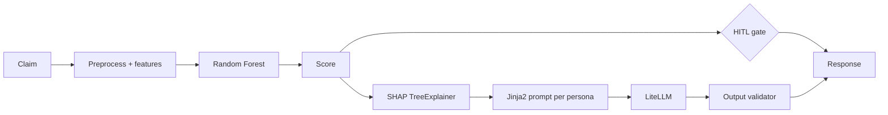

# DESIGN — GenAI-Powered Claim Approval Agent

**Scope** Device-insurance claims (accidental damage, liquid damage, theft) for the
Netherlands, Sweden and Finland. 2,880 historical claims, 35 columns.

---

## Summary

**The problem is not prediction. It is explanation.** A classifier that outputs
Approved/Declined has existed for twenty years. What the business lacks is the ability to tell
a customer *why*, an adjuster *on what evidence*, and an auditor *under which model and prompt
version*.

The system therefore splits in two: **the ML model decides, the LLM explains, and no code path
lets the LLM alter a decision.** Predictions stay deterministic, reproducible and auditable;
explanations become natural language adapted to three audiences.

Three decisions carry the most weight:

1. **SEK/EUR normalisation.** The dataset mixes currencies without declaring it. Uncorrected,
   the amount columns act as a second encoding of `country` and SHAP splits one contribution
   across four features, destroying the attribution the explanations are built from.
2. **`productName` is mined, not dropped.** It is a composite code carrying contract length,
   payment mode, policy class and device type. It takes `deviceType` from 48.4% missing to 0%.
3. **Human-in-the-Loop is a data-driven requirement, not a disclaimer.** The strongest
   categorical signals sit on 28-row and 67-row subgroups. The structured features support
   triage; they do not support autonomous adjudication.

**Honest limitation, stated up front:** the tabular features describe the policy and the
device, not the circumstances of the loss, and the circumstances are what drive a decline.
That information exists in the dataset, but as multilingual prose.

The measured result reflects that. The selected model reaches **F1-Declined 0.344 and recall
0.662**, it catches two declines in three, at four false alarms for every five flags. Its
accuracy is 60%, *below* the 84% a constant classifier scores, and that is the intended
trade. It is a triage instrument, not an adjudicator: the value of this system is the
explanation layer, and the human review the numbers above make mandatory.

---

## 1. Problem and objectives

Every claim is reviewed by a human regardless of how clear it is, roughly 84% are approved,
and two adjusters can reach opposite conclusions on comparable claims. A declined customer
receives *"your claim has been declined"*, no reason, no recourse. Internally, the reasoning
behind a past decision is not reconstructable, which fails GDPR Article 22 and the EU AI Act's
transparency provisions: *"the system declined it"* is not a meaningful explanation.

Three audiences need the same decision presented three ways. An adjuster denied the SHAP
values cannot do their job; a customer shown them learns nothing.

| # | Objective | Success measure |
| --- | --- | --- |
| O1 | Predict claim outcome from structured data | F1-Declined and Recall-Declined, honestly reported |
| O2 | Explain each decision per persona | Faithfulness > 0.80, hallucination < 0.20 (DeepEval, in CI) |
| O3 | Expose the capability as a REST  | p95 < 200 ms `/predict`, < 5 s `/explain` |
| O4 | MLOps, experiments, models, versions | Every run reproducible from MLflow |
| O5 | LLMOps, prompts, tokens, latency, cost | Every call traced in Langfuse |
| O6 | Every decision explainable and auditable | Model + prompt version pinned per prediction |

Accuracy is explicitly excluded as a metric. Predicting "Completed" for everything scores
84.3%. Any metric a constant classifier can win is not measuring the problem.

**Non-objective:** replacing the adjuster.

---

## 2. Architecture — two problems, not one

**Decision.** Separate the two engines completely. The ML model decides, the LLM explains, and
no code path lets the LLM alter a score, a threshold, or an outcome.

**Problem A: prediction.** *Will this claim be declined?* A classification problem.

**Problem B: explanation.** *How do we express why?* A natural-language generation problem.

Conflating them is the common failure mode. Asking an LLM to *decide* produces a system that
is unauditable, non-reproducible, and free to hallucinate its way to an outcome.

Because the LLM only ever receives facts already computed, the score, the SHAP attributions,
the claim fields, it has nothing to invent a decision *from*. This reduces hallucination
structurally rather than merely discouraging it in a prompt.

The split also buys operational independence: `/predict` has no external dependency, so an LLM
outage degrades explanations while decisions keep working.

**Design principles:** separation of concerns · modularity · explainability by design (no
decision returned without SHAP-backed explanation) · human-centred · provider-agnostic ·
observability wired in from the start, not retrofitted.

---

## 3. What the data actually supports

**Finding.** The structured features support triage, not adjudication. Every design choice
below follows from this. It was established before any model was trained, and the measured
results in §5.1 confirmed it.

Measured from the source file:

| Fact | Value |
| --- | --- |
| Shape | 2,880 × 35 |
| Class balance | 2,427 Completed / 453 Declined: 5.36 : 1 |
| Decline rate by claim type | Theft 20.4% (n=98) · Liquid Damage 19.4% (n=67) · Accidental 15.5% (n=2,715) |
| Decline rate by policy status | Grace Period 28.6% (n=28) · Active 15.6% · InActive 0% (n=3) |
| Decline rate by device | Wearables 45% (n=62) · Laptop 30% (n=50) · Smartphone 15% (n=2,678) |
| Median `rrp` | SE 14,990 (SEK) · NL and FI 1,449 (EUR) |
| `issueDesc` | 0% null, median 205 characters, four languages |

The strongest categorical signals sit on the smallest samples. Grace Period declines at
nearly double the base rate, on 28 claims. A model will find these patterns; nothing can
validate them at that sample size.

This is the empirical justification for Human-in-the-Loop. It is not a hedge added for
comfort: it follows from the sample sizes above.

---

## 4. Key data decisions

### 4.1 Currency normalisation

**Decision.** Convert SEK to EUR at a data-derived 10.3, and add currency-invariant ratios so
the model does not depend on that rate being exact.

SE amounts are SEK; NL and FI are EUR. Nothing in the file declares it.

| Column | SE median | NL/FI median | Implied rate |
| --- | --- | --- | --- |
| `rrp` | 14,990 | 1,449 | 10.35 |
| `excessFee` | 619 | 59 | 10.49 |
| `balanceRRP` | 14,490 | 1,399 | 10.36 |

Three independent columns agreeing to within 1% is what makes this a currency mix rather than
Swedes buying more expensive phones.

Left uncorrected this is currency leakage, and the damage is not limited to accuracy.
Because `country` is already a feature, the raw amounts become a second, implicit encoding of
it, and SHAP splits country's true contribution across four correlated features. Attribution
becomes meaningless, and attribution is what the LLM consumes. Corrupting it corrupts the
deliverable.

The rate lives in `configs/training.yaml`. The three ratios — `fee_to_rrp_ratio`,
`balance_ratio`, `remaining_balance_ratio`, are invariant by construction: 500/1,000 and
5,000/10,000 both give 0.5. The normalised absolutes are kept through training and pruned
afterwards only if SHAP shows they add nothing, so the final feature set is an empirical
result rather than an assumption.

*Rejected, ratios only:* discards real information. A €199 excess on a €400 device and on a
€3,199 device are different economics, and absolute exposure matters at different price tiers.
*Rejected, document and move on:* documenting a known defect does not neutralise it.

### 4.2 Corrupted customer narrative

**Decision.** Repair the encoding with a strict cp1252 round-trip, before the text reaches the
LLM. 1,290 corrupted rows become 3.

1,290 of 2,880 `issueDesc` values (45%) are double-encoded UTF-8: the file was written as
UTF-8 and read back as cp1252, in some rows twice. `från` arrives as `frÃ¥n`, and the worst
rows as `från`.

This costs the classifier nothing — `issueDesc` is not a feature, which is exactly why a
metrics-driven review would never surface it. It is the only account of what happened to the
device, and it is the input to the explanation layer. Unrepaired, a Swedish customer receives
their own words back as mojibake.

**cp1252 specifically, not latin-1:** the second corruption pass produces `ƒ` (U+0192), which
latin-1 cannot encode, so a latin-1 repair raises and silently skips precisely the worst rows.

### 4.3 `productName` — the column most pipelines discard

**Decision.** Mine it for four signals rather than dropping it. `deviceType` goes from 48.4%
missing to 0%.

`SE_MANDATORY_ADLD_24M_UPFRONT_SMARTPHONE` looks like redundant free text restating columns
that already exist. It is a composite code:

country · policy class · coverage · **contract length** · **payment mode** · **device type**

Three of those exist in no other column. The fourth fills the 48.4% hole in `deviceType`,
agreeing with the stated value on **98.7%** of rows where both are present, the check that
makes the parse trustworthy rather than merely convenient.

Parsing is by **token membership, not position**: the code runs 5 to 8 segments long, and a
positional parser reads the wrong field on 40% of the catalogue.

### 4.4 Missing diagnostics as signal

**Decision.** Mark un-run checks with a `-1` sentinel and make completeness a feature. The
absence is information, so imputing it away destroys information.

Nine diagnostic fields are 7–24% missing, structurally: a phone-channel claim never fills the
checklist, and phone claims decline at 10.5% against 15.9% for the portal.

Imputing `0` would assert *"tested, found broken"*, factually false. The sentinel `-1` keeps
*"never assessed"* as its own state, and `diag_completeness` turns the missingness pattern
into a feature.

**Deliberate non-decision.** The `0`/`1` polarity is undocumented in the source, and the
columns disagree about it
(`turnOnOff` is 82% ones, `buttons` 92% zeros). Rather than collapse them into a
`total_failures` count that hardcodes a guess, `diag_ones` and `diag_zeros` count each value
separately and let SHAP report the direction from evidence.

### 4.5 Free text held out of the model

**Decision.** The richest field in the dataset never becomes a model feature; it goes to the
LLM instead.

Any embedding of `issueDesc` would produce hundreds of dimensions over 2,880 rows and 453
positives, memorisation, not learning. Routed to the explanation layer it improves the output
without destabilising the model. Only language-independent metadata (length, word count)
enters the matrix.

This is the separation of concerns paying for itself: the text is used where it helps and
excluded where it hurts.

### 4.6 Other data-quality handling

| Finding | Handling |
| --- | --- |
| 3 rows `rrp = 0`, 1 negative `balanceRRP` | Set to NaN, rows retained: `0` would be read as a real extreme value and distort every ratio built on it |
| `oldBalanceRRP` ≡ `balanceRRP`, all 2,880 rows | Dropped, collinearity halves each feature's SHAP |
| `deviceCost`, `relationship`, `make` constant | Dropped, zero variance, an artefact of a single-manufacturer export |
| `smashed`, `frontOrBackCamera`, one value, 65% null | Dropped, degenerate |
| `policy_start_year` | Excluded from the matrix, a constant to any model serving next year. Month kept: seasonality repeats |
| Mixed date formats | `dayfirst=True`, correct for all three locales |
| `balanceRRP > rrp` | Never occurs, consistency check passes |

---

## 5. Technology decisions

**Every choice below is driven by one constraint: exact, fast attribution is the product, so
nothing may be adopted that degrades it.**

| Layer | Choice | Deciding reason |
| --- | --- | --- |
| Model | Random Forest (tuned) | Selected on measurement, not expectation, see §5.1. Best F1-Declined, best recall, and best calibration among the tuned candidates |
| Benchmark | LR · RF · XGBoost · CatBoost · LightGBM · MLP | Identical folds, so rejections rest on a number rather than an assertion |
| Explainability | SHAP `TreeExplainer` | Exact Shapley values in polynomial time, milliseconds per prediction, fast enough for the request path |
| Tuning | Optuna | TPE with pruning: ~50 trials where grid search needs thousands |
| Tracking | MLflow | Open-source and self-hostable, which matters because the artefacts are commercially sensitive. Promotion uses registry aliases, not stages, stages were deprecated in 2.9 and are removed in 3.x |
| LLM access | LiteLLM | One interface, provider fallback, retry. Vendor change is a config line |
| LLM chain | Groq Llama 3.3 → OpenAI → Gemini | An ordered chain, not a pair. The fallbacks are *different vendors*: a fallback sharing infrastructure with the primary is not a fallback. Two extra Groq keys sit between them as quota headroom, separate token buckets, same vendor, so they survive an exhausted budget and not an outage |
| Prompts | Jinja2 files | `prompt = f"..."` makes every wording change a code change and prompt versioning impossible |
|  | Fast | Native async, Pydantic validation at the boundary, generated Open |
| LLM observability | Langfuse | Per-call prompt, tokens, cost, latency, provider, errors |
| LLM evaluation | DeepEval | Faithfulness, relevancy, hallucination, as pytest, so a prompt regression fails the build |
| Provider equivalence | Promptfoo | Narrow scope: proving the fallback behaves like the primary |
| Drift detection | PSI, ~40 lines | Population Stability Index over frozen training bins. Small enough to defend term by term; a library here would add a surface nobody has read |
| CI | GitHub Actions | ruff → mypy → pytest → docker build, and no secrets: with no provider key the LLM client runs in mock mode, so the pipeline is free, offline and deterministic |
| Deployment | Docker, AWS by design | Identical environment dev → CI → demo; production architecture documented, not provisioned |

Four of these need more than a line.

### 5.1 Model selection — the data overruled the expectation

Six families, identical folds, threshold chosen inside each fold. The top three were then
tuned with Optuna (50 trials each) and re-evaluated under the same honest protocol.

| Model | F1-Declined | Recall | Precision | ROC-AUC | PR-AUC | Brier |
| --- | --- | --- | --- | --- | --- | --- |
| Random Forest (tuned) | 0.3438 ±0.032 | 0.6621 | 0.2327 | 0.6605 | 0.2913 | 0.1629 |
| Random Forest | 0.3362 ±0.031 | 0.5961 | 0.2364 | 0.6500 | 0.2780 | 0.1361 |
| CatBoost (tuned) | 0.3228 ±0.042 | 0.5608 | 0.2279 | 0.6446 | 0.2997 | 0.1930 |
| XGBoost (tuned) | 0.3208 ±0.031 | 0.5761 | 0.2251 | 0.6463 | 0.2787 | 0.2197 |
| XGBoost | 0.3078 ±0.035 | 0.6865 | 0.2011 | 0.6312 | 0.2648 | 0.1793 |
| LightGBM | 0.2910 ±0.032 | 0.6308 | 0.1945 | 0.6210 | 0.2650 | 0.1910 |
| Logistic Regression | 0.2946 ±0.027 | 0.5342 | 0.2044 | 0.6208 | 0.2478 | 0.2339 |
| MLP | 0.2765 ±0.008 | 0.5188 | 0.1919 | 0.5711 | 0.2169 | 0.2150 |
| *constant classifier* | *0.0* | *0.0* |: | *0.5* | *0.157* |: |

**XGBoost was the expected winner and did not win.** Random Forest leads on F1, on recall,
and on calibration, the three that matter here, and it does so despite losing the one
criterion that favoured XGBoost, native missing-value handling. Selection followed the
measurement.

Weighting F1 35%, recall 20%, calibration 15%, SHAP quality 15%, fold stability 10% and
native NaN support 5% gives Random Forest 0.89 against 0.33 for tuned XGBoost. No defensible
re-weighting reverses that, because the win is on the raw metrics rather than on the weights.

Two results worth stating plainly:

- **The MLP finishes last** (F1 0.2765, ROC-AUC 0.5711). The rejection of neural networks
  rests on a number, not an assertion. 2,880 rows is far below the regime where networks
  beat gradient boosting on tabular data, and an MLP's only SHAP option is KernelExplainer —
  approximate and orders of magnitude slower. **The choice of explainer constrains the choice
  of model, deliberately:** in a regulated setting, exact attribution outranks a marginal
  accuracy gain.
- **The spread from best to worst is 6.7 F1 points**, and tuning moved the winner by 0.008.
  The bottleneck is the signal in the data, not the algorithm or its hyperparameters.

Calibration is a selection criterion, not a footnote because the HITL gate reads the
score *as a probability*: thresholds of 0.30 and 0.70 mean nothing if the score is
systematically inflated.

**Why SHAP over LIME.** LIME's local surrogates are unstable across runs. An audit trail that
changes when re-run is not an audit trail.

**Why Promptfoo, given DeepEval.** They differ on axis: DeepEval asks *"is this output good?"*
(pass/fail, in CI); Promptfoo asks *"do two providers behave the same?"* If the primary fails
at 03:00 and Gemini serves customers, someone must already have confirmed Gemini holds the
customer persona, does not leak SHAP terminology, and handles Swedish and Dutch narratives. An
unvalidated fallback is untested code on the critical path. It is **not** used here for prompt
A/B testing, that would not justify the tool at this scope.

### 5.2 Synthetic minority data — tested, then rejected

**Decision: no synthetic claims are generated for training.** SMOTE, ADASYN and naive
duplication were all evaluated.

None adds information. **PR-AUC, threshold-free, so it measures ranking quality rather than
an operating point, does not move**, and naive duplication matches SMOTE. If interpolation
created signal, it would beat copy-paste.

The reason is measurable: among the five nearest neighbours of a declined claim, only **19%
are declines**, against 15.7% at random. The minority class is not clustered, so SMOTE
manufactures synthetic declines inside regions occupied by genuine approvals.

The constraint is signal, not volume. And there is a second reason that outranks the first:
**fabricating claim records to train an insurance decision model is manufacturing evidence.**
Synthetic data is used here only for tests and the  demo, where it is labelled as such.

### 5.3 What is monitored after deployment

| Signal | Threshold | Why it exists |
| --- | --- | --- |
| PSI per feature | watch 0.10 · alarm 0.20 | Credit-scoring convention, not derived from this dataset, a triage aid, not a decision rule |
| PSI on the score itself | same | Measured: a batch can breach on nine features while the score distribution stays inside its band. Every input can move in directions the model does not weigh |
| Provider fallback rate | 10% | The earliest available sign that the primary is degrading, and it costs nothing to collect |
| Template fallback rate | 1% | No LLM answered at all. One occurrence is an incident, not a rate to tolerate |
| `/explain` p95 latency | 5 000 ms | Suppressed below 20 calls: a percentile over a handful of samples is not a measurement |
| Monthly LLM spend | alert at 80% of budget | An alarm that fires once the money is spent is a report, not an alert |

Cost and latency are recorded per call in an append-only ledger, a file rather than a
counter, because the  runs multiple workers and restarts, and a counter that resets on
deploy cannot answer *"what did we spend this month?"*. It carries no prompt and no response:
an operations artefact must not make a claim narrative recoverable.

---

## 6. Technologies deliberately excluded

| Technology | Why not |
| --- | --- |
| RAG | The decision rests on structured policy and claim attributes, not unstructured knowledge retrieval. The LLM explains model outputs from SHAP values, there is nothing to retrieve. If policy documents are added later, RAG could augment the explanation layer without touching prediction |
| Fine-tuning | The requirement is controllable persona behaviour, not domain adaptation. Fine-tuning bakes persona rules into weights, making them harder to audit, version and explain to a regulator. Jinja2 templates are diffable and reviewable in git |
| LangChain | No agents, no RAG, no chains. LiteLLM does provider fallback in one line; LangChain adds 15+ classes for a single  call |
| LIME | Unstable local surrogates, unacceptable for an audit trail |
| DSPy | Automatic prompt optimisation is unnecessary for three fixed personas |
| RAGAS | Built for retrieval-augmented systems; there is no retrieval |
| SMOTE / synthetic claims | Measured, not assumed: PR-AUC unchanged, and naive duplication matches SMOTE, see §5.2. Beyond the measurement, generating claim records to train a decision model is manufacturing evidence |
| Evidently AI | PSI is ~40 lines and every term is defensible. A drift library adds a dependency surface to a component whose whole job is to be trusted |
| Redis semantic cache | Claims are near-unique; hit rate would be negligible. Noted as a future option |
| Guardrails AI / NeMo | Aimed at open-ended conversation. Output here is a fixed schema; the custom validator covers it |
| Airflow / Kubernetes | No scheduled ETL, and orchestration complexity a single-container prototype does not need |
| SageMaker Endpoints / Lambda | Always-on cost, and model-load cold starts exceed the latency budget |

---

## 7. Human-in-the-Loop and responsible AI

**Decision.** The system never issues an adverse decision alone. At any score, a decline
requires a human. This makes it an AI-assisted, not AI-autonomous, decision system.

The score is `P(Declined)`. The business decision layer sits between prediction and
explanation, so the operating point can be retuned for business cost without retraining
anything.

| Score | Routing | Volume | Decline rate | Share of all declines |
| --- | --- | --- | --- | --- |
| < 0.30 | Straight-through processing candidate | 45.0% | 9.1% | 26.0% |
| 0.30 – 0.70 | Human review required, borderline confidence | 54.3% | 20.6% | 71.1% |
| ≥ 0.70 | Mandatory expert review, high decline risk | 0.8% | 59.1% | 2.9% |

*Measured on out-of-fold predictions from the selected model, all 2,880 claims.*

The routing works: the straight-through band declines at 9.1% against a 15.7% base rate —
little over half the risk, while the expert band, though only 22 claims, declines at 59.1%,
a 3.8× lift. The selected threshold is stable at 0.344 ± 0.010 across folds, so the operating
point is not fitted to one split.

The wording matters. A low score makes a claim *eligible for the straight-through queue*; it
is not itself an approval. That distinction is the one an insurance regulator cares about.

Forced-review triggers apply independently of the score and follow directly from §3: Theft
claims, Grace Period policies, `rrp` above €2,500, and fewer than three diagnostic checks.

**The system never auto-declines.** At any score, an adverse decision requires a human. This
makes it an *AI-assisted* rather than *AI-autonomous* decision system. The adjuster's decision
also becomes labelled training data, closing the feedback loop.

**Bias.** Historical labels record what adjusters decided, so any past bias is learnable. F1
and false-decline rate are monitored per country, channel and device type, with disparity
above 5 percentage points flagged.

**PII.** `issueDesc` is customer free text, already `***`-masked at source. It never reaches a
log line, redaction is applied centrally in the log formatter, not at call sites. A DPA is
required with each LLM provider.

**Prompt injection.** `issueDesc` is untrusted input. Defence in depth: the text is isolated in
an XML block, the system prompt states that instructions inside that block are not to be
followed, and the output validator checks the response for schema compliance and information
leakage. No single layer is sufficient.

### 7.1 Where customer data can escape, and what stops it

Four exits, each closed at the boundary rather than by convention.

| Exit | Control | Verified by |
| --- | --- | --- |
| Application logs | Redaction in the log formatter, not at call sites, a new log line cannot forget it | Field list in `logger.py` |
| HTTP error responses | Pydantic attaches the whole submitted body to every 422 under `input`. Stripped | `test_422_does_not_echo_the_customer_narrative` |
| LLM observability | Langfuse receives cost, latency, provider, tokens and a SHA-256 digest of the prompt, never its text | Trace payload asserted in review |
| Operations ledger | Thirteen operational fields, no free text, no content field | `TestLedgerPrivacy` |

The second was a real defect, not a hypothetical: the first 422 returned the customer's
narrative in the response body. It was Pydantic's default behaviour, and the kind of leak that
survives a careful logging policy by going out the next door along.

Two further controls sit on the response itself. Persona filtering is applied **in the context
built for the prompt**, not by instructing the model, a field that was never supplied cannot
be leaked by a wording mistake, and again in the response envelope, because a client renders
what it receives. The output validator then checks the generated text against a 22-term
blocklist before it is returned.

---

## 8. Risks

| # | Risk | Impact | Mitigation |
| --- | --- | --- | --- |
| R1 | Weak minority-class signal limits autonomous decisioning | High | Positioned as triage; HITL on every decline; honest metric reporting |
| R2 | LLM fabricates a fact | High | Numeric grounding check, DeepEval hallucination metric, retry then template fallback |
| R3 | Prompt injection via `issueDesc` | High | Isolated block, explicit system rule, output validation, adversarial tests |
| R4 | Model internals leak to a customer | Medium | Persona field filtering plus blocklist validation |
| R5 | Learned bias from historical decisions | High | Per-group F1 and false-decline rate; flag disparity > 5pp |
| R6 | Feature drift after deployment | Medium | PSI per feature and on the score; a feature breach alone opens an investigation, it does not trigger a retrain |
| R7 | Every LLM provider unavailable | Medium | `/predict` unaffected; `/explain` degrades to a deterministic template. Measured: the chain moved to a reserve key mid-demo and `/metrics` flagged it |
| R8 | Threshold tuned on limited data does not transfer | Medium | Threshold selected inside CV folds, never on the full set |
| R9 | Champion promoted to a library the serving image does not carry | Low | The image ships scikit-learn only, deliberately. Promotion is a two-part change, and the runbook gives the pre-deployment check |

---

## 9. Open questions for the data owner

1. **Decline reason codes**, is a structured reason recorded anywhere? It would be the single
   most valuable addition to both the model and the explanations.
2. **Cost asymmetry**, what is the business cost ratio between a false approval and a false
   decline? The optimal threshold cannot be chosen without it. F1 assumes they cost the same,
   which is almost certainly untrue.
3. **Label timing**, does `status` reflect the initial decision or the outcome after appeal?
   This changes what the model is learning.
4. **Currency**, is a static 10.3 acceptable, or should conversion use the rate at claim date?
   The dataset spans months over which the true rate moved.
5. **`InActive` policies** — 3 rows, 0 declines. Are these rejected upstream, making the label
   unrepresentative?

---

## 10. Assumptions and limitations

**Assumptions.** Historical labels are ground truth. The training distribution resembles
production (drift monitoring exists because this expires). `Completed` means approved and paid.
Diagnostics are missing not-at-random. `issueDesc` is untrusted input. Constant columns are
export artefacts, if a second manufacturer appears, that assumption must be revisited. EU data
protection applies throughout.

**Limitations.** 2,880 rows is the ceiling available in the project window, which bounds model
complexity and is the principal reason a neural network is rejected. The strongest categorical
signals rest on subgroups of 28 to 98 rows and cannot be validated at that size. A single
static FX rate is applied to a dataset spanning months. The structured features do not capture
the circumstances of the loss, which is what actually drives a decline, so the classifier
should be read as a triage instrument, and the explanation layer as the deliverable.
