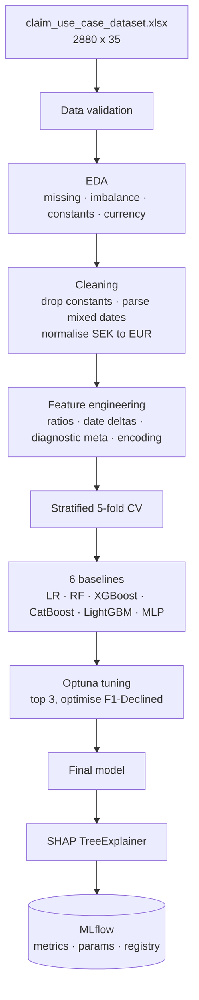
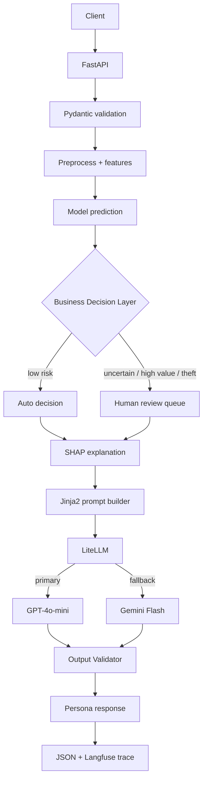

# GenAI-Powered Insurance Claim Approval Agent

An AI decision-support system for device-insurance claims. It predicts whether a claim will
be approved or declined, and explains **why** — in language matched to who is reading:
customer, claims adjuster, or auditor.

Two independent AI systems, deliberately separated:

> **The Machine Learning model decides. The Large Language Model explains.**

That separation is the central architectural decision. The LLM never invents a decision — it
converts factual evidence (SHAP attributions over real claim fields) into natural language.
An LLM hallucination can degrade an explanation; it can never change a claim outcome.

---

## Business problem

Insurance companies process thousands of claims daily. Today the work is manual and depends
on adjuster expertise, which produces four problems.

**Slow.** Every claim is reviewed by hand, including the ~84% that are routine approvals.
Review time scales with volume; waiting time grows with it.

**Inconsistent.** Two adjusters can reach different conclusions on comparable claims.
Decisions reflect individual experience rather than a shared standard.

**Unexplained.** A declined customer receives *"your claim has been declined"* with no
reason. Complaints rise, trust falls, the contact centre absorbs the difference.

**One-size-fits-all information.** A customer needs plain language. An adjuster needs
technical evidence. An auditor needs model version, prompt version, SHAP values, and full
traceability. The same decision must be presented three different ways.

And a fifth constraint that shapes the whole design: **AI must not decide alone.** Borderline
cases, suspected fraud, and high-value claims belong with a human. This is an *AI-assisted*
decision system, not an *AI-autonomous* one.

## Architecture

### Offline — training



### Online — inference



### Personas

| Persona | Sees | Never sees |
| --- | --- | --- |
| **Customer** | plain-language reason, next steps, appeal path | score, SHAP values, any model internals |
| **Adjuster** | score, top-10 SHAP factors, risk flags, claim narrative | — |
| **Auditor** | everything, plus model version, prompt version, data lineage, timestamps | — |

One prediction, one SHAP computation, three renderings. Persona is a **filter over
information flow**, not a different model — which guarantees the customer letter and the
audit record describe the same event.

## Dataset

2,880 claims × 35 columns. Device insurance (mostly smartphones) across NL, SE, FI, under an
anonymised brand. Verified before any modelling:

| Property | Value | Consequence |
| --- | --- | --- |
| Target `status` | 2,427 Completed / 453 Declined — **5.36 : 1** | Optimise F1-Declined; accuracy is unusable (a constant classifier scores 84.3%) |
| **Currency mixing** | SE amounts in SEK, NL/FI in EUR — median `rrp` 14,990 vs 1,449 | **Country leakage.** Normalised at rate 10.3, derived from the data |
| Constant columns | `deviceCost`=0, `relationship`='self', `make`='WUAWEI' | Dropped — zero variance |
| Duplicate column | `oldBalanceRRP` ≡ `balanceRRP`, 100% identical | Dropped |
| Degenerate flags | `smashed`, `frontOrBackCamera` — single value, 65% null | Dropped |
| Decline rate by type | Theft 20.4% · Liquid Damage 19.4% · Accidental 15.5% | Signal exists, but on 98 and 67 claims respectively |
| Decline rate by policy | Grace Period 28.6% (n=28) · Active 15.6% | Strongest signal, thinnest sample — never automated |
| Mixed date formats | ISO datetime **and** DD/MM/YYYY in one column | `format='mixed', dayfirst=True` |
| Free text | `issueDesc` 0% null, median 205 chars, SE/NL/FI/EN | Excluded from ML features, routed to the LLM |

Two findings drive the design. **The currency leak** would have made `rrp` a disguised copy
of `country`, corrupting the SHAP attribution the explanations are built on. **The strongest
categorical signals sit on the smallest samples** — which is precisely why a human stays in
the loop.

## Setup

```bash
make install-dev            # venv on Python 3.12 + all tooling
cp .env.example .env        # API keys optional — without them the LLM runs in mock mode
# place data/claim_use_case_dataset.xlsx
```

## Quick start

```bash
make eda            # exploratory analysis, plots to artifacts/plots
make train          # benchmark 6 models, tune top 3, register the winner
make evaluate       # cross-validated metrics and reports
make serve          # API on http://localhost:8000  (docs at /docs)
make test           # pytest
make eval-llm       # DeepEval: faithfulness, relevancy, hallucination
make eval-providers # Promptfoo: fallback provider equivalence
```

Container:

```bash
make docker-build && make docker-run
```

## API

| Endpoint | Purpose | Target |
| --- | --- | --- |
| `POST /api/v1/predict` | Score and routing decision — no LLM call | < 200 ms |
| `POST /api/v1/explain` | Score + SHAP + persona explanation | < 5 s |
| `GET /api/v1/health` | Model version, prompt version, provider reachability | < 50 ms |

Demo `curl` commands land here at Phase 3.1.

## Technology

| Layer | Choice | Why |
| --- | --- | --- |
| Model | XGBoost, selected against 5 alternatives | Native missing-value handling, exact TreeSHAP, mature in finance/insurance |
| Explainability | SHAP `TreeExplainer` | Exact Shapley values in polynomial time — fast enough for the request path |
| Tuning | Optuna | Bayesian search with pruning; ~50 trials replaces thousands |
| Tracking | MLflow | Experiments, params, metrics, model registry, reproducibility |
| LLM access | LiteLLM | One interface for OpenAI and Gemini; automatic fallback and retry |
| LLM | GPT-4o-mini primary, Gemini Flash fallback | Reliable structured JSON at low cost; fallback is a *different vendor* |
| Prompts | Jinja2, git-versioned | Prompt changes never touch Python |
| Validation | Pydantic v2 + custom `OutputValidator` | Type safety at the boundary, hallucination and leakage checks on the way out |
| LLM observability | Langfuse | Prompt, response, tokens, cost, latency, errors |
| LLM evaluation | DeepEval (CI) + Promptfoo (provider equivalence) | Code correctness and output *quality* are different tests |
| API | FastAPI | Async, Pydantic-native, automatic OpenAPI docs |
| Container | Docker | Identical environment local → CI |
| CI | GitHub Actions | pytest + DeepEval + image build on every push |

Full justification with rejected alternatives: **[DESIGN.md](DESIGN.md)**.

## Project structure

```
claim-approval-agent/
├── configs/          api.yaml · training.yaml · llm.yaml
├── data/             source dataset (git-ignored)
├── notebooks/        01_eda · 02_model_training · 03_model_comparison · 04_demo
├── prompts/          system · customer · adjuster · auditor  (.jinja2)
├── evaluation/       promptfoo.yaml
├── src/
│   ├── common/       logger · settings
│   ├── data/         loader · validator · preprocessor · feature_engineer
│   ├── models/       train · compare · evaluate · registry
│   ├── explainability/  shap_service
│   ├── genai/        llm_client · prompt_engine · personas · output_validator
│   ├── api/          app · routes · schemas
│   └── monitoring/   metrics · drift · llm_monitor
├── tests/
├── artifacts/        models · plots · reports
└── infrastructure/   aws (design only) · ci_cd
```

## Deployment scope

Runs locally via Docker. The AWS production architecture (API Gateway, ECS Fargate, S3, ECR,
RDS, CloudWatch, Secrets Manager) is **designed and documented in DESIGN.md, not
provisioned** — deliberate scoping for a take-home, with the architecture shown rather than
billed for.
