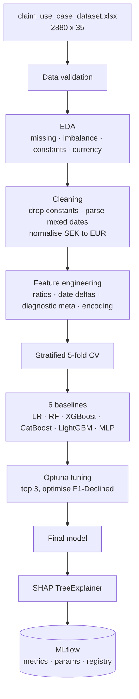
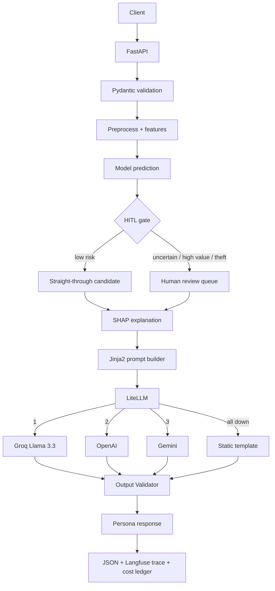

# GenAI-Powered Insurance Claim Approval Agent

An AI decision-support system for device-insurance claims. It predicts whether a claim will
be approved or declined, and explains **why** — in language matched to who is reading:
customer, claims adjuster, or auditor.

Two independent AI systems, deliberately separated:

> **The Machine Learning model decides. The Large Language Model explains.**

That separation is the central architectural decision. The LLM never invents a decision — it
converts factual evidence (SHAP attributions over real claim fields) into natural language.
An LLM hallucination can degrade an explanation; it can never change a claim outcome.

---

## Business problem

Insurance companies process thousands of claims daily. Today the work is manual and depends
on adjuster expertise, which produces four problems.

**Slow.** Every claim is reviewed by hand, including the ~84% that are routine approvals.
Review time scales with volume; waiting time grows with it.

**Inconsistent.** Two adjusters can reach different conclusions on comparable claims.
Decisions reflect individual experience rather than a shared standard.

**Unexplained.** A declined customer receives *"your claim has been declined"* with no
reason. Complaints rise, trust falls, the contact centre absorbs the difference.

**One-size-fits-all information.** A customer needs plain language. An adjuster needs
technical evidence. An auditor needs model version, prompt version, SHAP values, and full
traceability. The same decision must be presented three different ways.

And a fifth constraint that shapes the whole design: **AI must not decide alone.** Borderline
cases, suspected fraud, and high-value claims belong with a human. This is an *AI-assisted*
decision system, not an *AI-autonomous* one.

## Architecture

### Offline — training



### Online — inference



### Personas

| Persona | Sees | Never sees |
| --- | --- | --- |
| **Customer** | plain-language reason, next steps, appeal path | score, SHAP values, any model internals |
| **Adjuster** | score, top-10 SHAP factors, risk flags, claim narrative | — |
| **Auditor** | everything, plus model version, prompt version, data lineage, timestamps | — |

One prediction, one SHAP computation, three renderings. Persona is a **filter over
information flow**, not a different model — which guarantees the customer letter and the
audit record describe the same event.

## Dataset

2,880 claims × 35 columns. Device insurance (mostly smartphones) across NL, SE, FI, under an
anonymised brand. Verified before any modelling:

| Property | Value | Consequence |
| --- | --- | --- |
| Target `status` | 2,427 Completed / 453 Declined — **5.36 : 1** | Optimise F1-Declined; accuracy is unusable (a constant classifier scores 84.3%) |
| **Currency mixing** | SE amounts in SEK, NL/FI in EUR — median `rrp` 14,990 vs 1,449 | **Country leakage.** Normalised at rate 10.3, derived from the data |
| Constant columns | `deviceCost`=0, `relationship`='self', `make`='WUAWEI' | Dropped — zero variance |
| Duplicate column | `oldBalanceRRP` ≡ `balanceRRP`, 100% identical | Dropped |
| Degenerate flags | `smashed`, `frontOrBackCamera` — single value, 65% null | Dropped |
| Decline rate by type | Theft 20.4% · Liquid Damage 19.4% · Accidental 15.5% | Signal exists, but on 98 and 67 claims respectively |
| Decline rate by policy | Grace Period 28.6% (n=28) · Active 15.6% | Strongest signal, thinnest sample — never automated |
| Mixed date formats | ISO datetime **and** DD/MM/YYYY in one column | `format='mixed', dayfirst=True` |
| Free text | `issueDesc` 0% null, median 205 chars, SE/NL/FI/EN | Excluded from ML features, routed to the LLM |

Two findings drive the design. **The currency leak** would have made `rrp` a disguised copy
of `country`, corrupting the SHAP attribution the explanations are built on. **The strongest
categorical signals sit on the smallest samples** — which is precisely why a human stays in
the loop.

## Setup

```bash
make install-dev            # venv on Python 3.12 + training and test tooling
cp .env.example .env        # API keys optional — without them the LLM runs in mock mode
make test                   # 118 tests, no dataset and no keys required
```

### What runs on a fresh clone, and what does not

The source extract is proprietary and the trained model is derived from it, so **neither is in
this repository**. That splits the project in two for a reviewer:

| Without the dataset | Needs `data/claim_use_case_dataset.xlsx` |
| --- | --- |
| `make test` — 113 tests run, 5 integration tests skip | `make train` — benchmark, tune, register (~8 min) |
| `make lint`, `make typecheck` | `make serve` / `docker compose up` — the API refuses to start without a model |
| Read the notebooks — all cells are committed **with their outputs** | `make eda` |

The three notebooks are the fastest way to see the measured results without running anything:
model comparison, SHAP attribution, HITL routing and the three persona explanations are all
rendered in place.

Starting the API without a model is a **deliberate** failure: `lifespan` raises rather than
serving, because a container that cannot decide a claim must never pass a health check.

Three dependency sets, because the serving image should not carry the training stack:
`requirements.txt` (serve) · `requirements-train.txt` (train, tune, plot) ·
`requirements-dev.txt` (both, plus test and evaluation tooling). Splitting them took the
image from **3.56 GB to 1.76 GB** — measured inside the container, the running process never
imports xgboost, catboost, lightgbm, optuna or the plotting libraries.

## Quick start

```bash
make eda            # exploratory analysis, plots to artifacts/plots
make train          # benchmark 6 models, tune top 3, register the winner
make evaluate       # cross-validated metrics and reports
make serve          # API on http://localhost:8000  (docs at /docs)
make test           # pytest
make eval-llm       # DeepEval: faithfulness, relevancy, hallucination  (opt-in, calls providers)
make eval-providers # Promptfoo: fallback provider equivalence
make drift-reference # freeze the training distribution the drift monitor compares against
```

Container:

```bash
docker compose up --build              # API on :8000, model mounted read-only
docker compose --profile tracking up   # + MLflow UI on :5000
```

`make test` runs 118 tests with no network and no keys. `make eval-llm` is **excluded from
the default run** — it calls real providers, so it costs money and is graded by a judge that
is itself sampled.

## API

| Endpoint | Purpose | Target | Measured |
| --- | --- | --- | --- |
| `POST /api/v1/predict` | Score and routing decision — **no LLM call** | < 200 ms | 108 ms in container |
| `POST /api/v1/explain` | Score + SHAP + persona explanation | < 5 s | 1.4–3.2 s |
| `GET /api/v1/health` | Model version, prompt version, provider chain | < 50 ms | — |
| `GET /api/v1/metrics` | LLM spend, fallback rate, latency against thresholds | — | — |
| `GET /api/v1/personas` | What each audience is permitted to see | — | — |

```bash
curl -X POST localhost:8000/api/v1/predict \
  -H "Content-Type: application/json" -d @examples/claim_borderline.json

curl -X POST localhost:8000/api/v1/explain \
  -H "Content-Type: application/json" \
  -d "$(jq '. + {persona:"customer"}' examples/claim_borderline.json)"
```

The two are separate endpoints on purpose: **the decision has no external dependency.** If
every LLM provider is down, `/predict` is unaffected and `/explain` returns a static
template. Full request/response catalogue: **[docs/API_TESTING.md](docs/API_TESTING.md)**.
Incident procedures: **[docs/runbook.md](docs/runbook.md)**.

## Technology

| Layer | Choice | Why |
| --- | --- | --- |
| Model | **Random Forest**, selected against 5 alternatives | Chosen on measurement, not expectation. Best F1-Declined, recall *and* calibration among tuned candidates — it beat XGBoost on every criterion except the one that favoured XGBoost |
| Explainability | SHAP `TreeExplainer` | Exact Shapley values in polynomial time — fast enough for the request path |
| Tuning | Optuna | Bayesian search with pruning; ~50 trials replaces thousands |
| Tracking | MLflow | Experiments, params, metrics, model registry, reproducibility |
| LLM access | LiteLLM | One ordered chain, automatic fallback and retry. Adding a provider is a config line |
| LLM chain | Groq Llama 3.3 → OpenAI → Gemini | Three separate vendors: a fallback sharing infrastructure with the primary is not a fallback |
| Prompts | Jinja2, git-versioned | Prompt changes never touch Python |
| Validation | Pydantic v2 + custom `OutputValidator` | Type safety at the boundary, hallucination and leakage checks on the way out |
| LLM observability | Langfuse | Cost, latency, provider, tokens — and a SHA-256 digest of the prompt, never its text |
| LLM evaluation | DeepEval + Promptfoo | Code correctness and output *quality* are different tests |
| Monitoring | PSI drift + cost ledger, ~40 lines each | Small enough to defend term by term; a library adds a surface nobody has read |
| API | FastAPI | Async, Pydantic-native, automatic OpenAPI docs |
| Container | Docker, multi-stage | Serving image carries no build toolchain and no training stack |
| CI | GitHub Actions | ruff → mypy → pytest → docker build, **with no secrets** — mock mode makes the pipeline free, offline and deterministic |

Full justification with rejected alternatives: **[DESIGN.md](DESIGN.md)**.

## Project structure

```
claim-approval-agent/
├── configs/          api · training · llm · monitoring  (.yaml)
├── data/             source dataset (git-ignored, proprietary)
├── docs/             API_TESTING.md · runbook.md
├── examples/         7 demo claims, one per routing band
├── notebooks/        01_eda · 02_model_comparison · 03_demo
├── postman/          collection, 17 requests · 97 assertions
├── prompts/          system · customer · adjuster · auditor  (.jinja2)
├── evaluation/       promptfoo.yaml · render_prompt.py · contexts/
├── src/
│   ├── common/       logger · settings
│   ├── data/         loader · preprocessor · feature_engineer
│   ├── models/       evaluator · trainer · tuner · tracking · registry
│   ├── explainability/  shap_service · feature_labels
│   ├── genai/        personas · llm_client · output_validator · explanation_pipeline
│   ├── api/          app · routes · schemas · middleware
│   └── monitoring/   drift · llm_monitor
├── tests/            118 tests
├── artifacts/        models · plots · reports  (git-ignored, regenerable)
└── .github/workflows/ci.yml
```

## Deployment scope

Runs locally via Docker. The AWS production architecture (API Gateway, ECS Fargate, S3, ECR,
RDS, CloudWatch, Secrets Manager) is **designed and documented in DESIGN.md, not
provisioned** — deliberate scoping for a take-home, with the architecture shown rather than
billed for.
